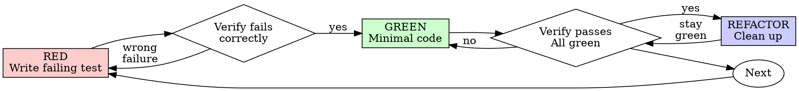

# Test-Driven Development (TDD)

## Overview
Write the test first. Watch it fail. Write minimal code to pass.

**Core principle:** If you didn't watch the test fail, you don't know if it tests the right thing.

**Violating the letter of the rules is violating the spirit of the rules.**

## When to Use
**Always:**
- New features
- Bug fixes
- Refactoring
- Behavior changes

Thinking "skip TDD just this once"? Stop. That's rationalization.

## The Iron Law
```
NO PRODUCTION CODE WITHOUT A FAILING TEST FIRST
```

Write code before the test? Delete it. Start over.

## Red-Green-Refactor


### RED - Write Failing Test
Write one minimal test showing what should happen.

**Requirements:**
- One behavior
- Clear name
- Real code (no mocks unless unavoidable)

### Verify RED - Watch It Fail
**MANDATORY. Never skip.**

Confirm:
- Test fails (not errors)
- Failure message is expected
- Fails because feature missing (not typos)

### GREEN - Minimal Code
Write simplest code to pass the test. Don't add features, refactor other code, or "improve" beyond the test.

### Verify GREEN - Watch It Pass
**MANDATORY.**

Confirm:
- Test passes
- Other tests still pass

### REFACTOR - Clean Up
After green only:
- Remove duplication
- Improve names
- Extract helpers

Keep tests green. Don't add behavior.

## Common Rationalizations
| Excuse | Reality |
|--------|---------|
| "Too simple to test" | Simple code breaks. Test takes 30 seconds. |
| "I'll test after" | Tests passing immediately prove nothing. |
| "Tests after achieve same goals" | Tests-after = "what does this do?" Tests-first = "what should this do?" |
| "Already manually tested" | Ad-hoc ≠ systematic. No record, can't re-run. |
| "Deleting X hours is wasteful" | Sunk cost fallacy. Keeping unverified code is technical debt. |
| "TDD will slow me down" | TDD faster than debugging. Pragmatic = test-first. |

## Verification Checklist
Before marking work complete:
- [ ] Every new function/method has a test
- [ ] Watched each test fail before implementing
- [ ] Each test failed for expected reason (feature missing, not typo)
- [ ] Wrote minimal code to pass each test
- [ ] All tests pass
- [ ] Edge cases and errors covered
