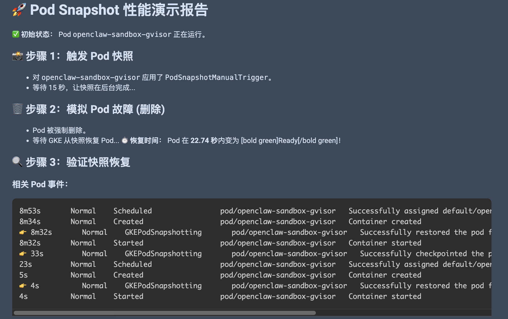
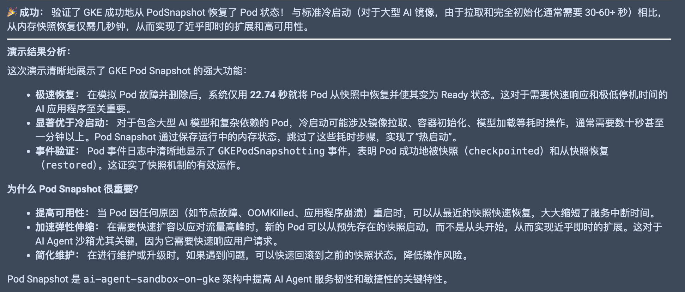
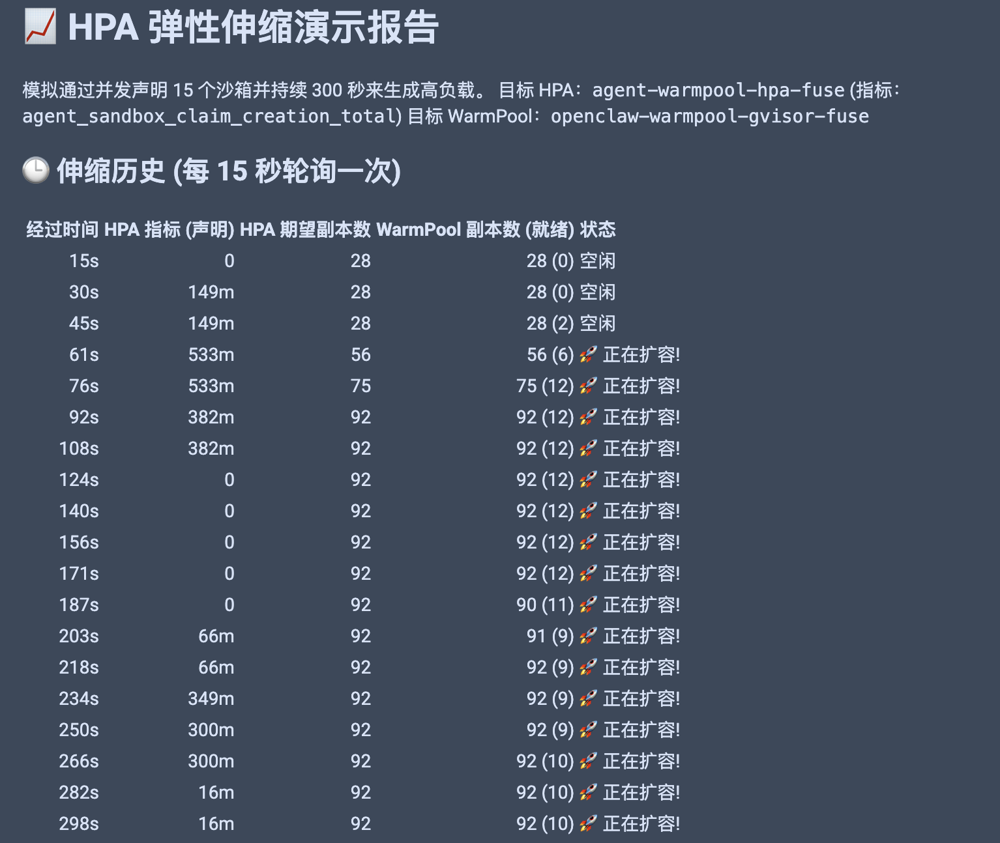
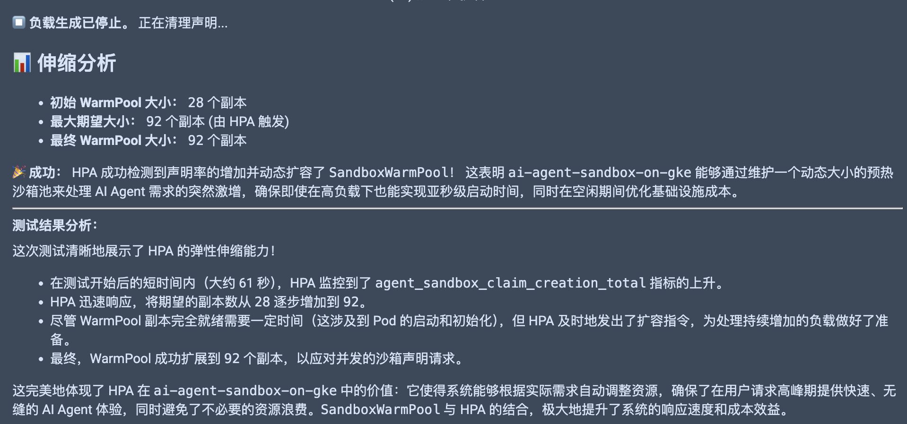
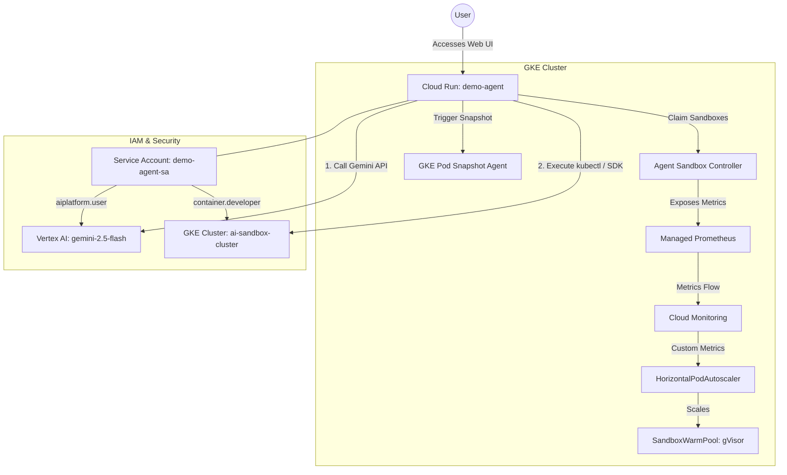

# 🤖 GKE Sandbox Demo Agent (Cloud Run Deployment)

This directory contains the source code, Dockerfile, and deployment configuration for the **GKE Sandbox Demo Agent**. This agent is built using Google's **Agent Development Kit (`google-adk`)** and is designed to demonstrate and analyze the advanced features of running AI Agent Sandboxes on GKE (using OpenClaw as an example application).

The agent runs on **Cloud Run** for low cost and easy access, and communicates directly with your **GKE Autopilot** cluster to perform live demonstrations of Pod Snapshots and HPA scaling.

## 🌟 Features Demonstrated by the Agent

1.  **🚀 Pod Snapshot Performance (Resume Analysis):**
    *   Triggers a `PodSnapshotManualTrigger` via `kubectl`.
    *   Forcibly deletes the active `openclaw-sandbox-gvisor` pod.
    *   Measures the exact time GKE takes to restore the pod from the memory snapshot.
    *   Verifies `GKEPodSnapshotting` events in the cluster.
    
    
    
2.  **📈 HPA Elastic Scaling (WarmPool Expansion):**
    *   Uses the `k8s-agent-sandbox` Python SDK to simulate heavy user load by concurrently claiming multiple sandboxes.
    *   Starts a background thread to monitor HPA metrics (`agent_sandbox_claim_creation_total`) and `SandboxWarmPool` replicas in real-time.
    *   Renders a live scaling history table showing the pool dynamically expanding to meet demand.
    *   Cleans up all test claims automatically after the test completes.
    
    
    
3.  **💬 Feishu Channel Configuration Guide:**
    *   Provides a step-by-step interactive guide on how to create a Feishu App, configure permissions, and link it to OpenClaw.
    *   Provides the exact commands to run inside the sandbox to complete the setup.
4.  **💾 Storage Options (FUSE vs PVC):**
    *   Provides an architectural comparison between **Cloud Storage FUSE** and **PersistentVolumeClaim (PVC via Filestore)**.
    *   Explains why **GCS FUSE is strongly recommended** for ephemeral AI agent workloads (Cost, Infinite Scaling, Instant Mounting).

---

## 🏗️ Architecture



---

## 🚀 One-Click Deployment via Cloud Build

We provide a `cloudbuild.yaml` that automates the entire deployment process, including creating the necessary Service Account, granting IAM roles, creating the Artifact Registry repository, building the Docker image, and deploying to Cloud Run.

### Prerequisites

Ensure your local terminal is authenticated to the correct project:
```bash
gcloud config set project flius-test-28
gcloud auth application-default login
```

### Execute Deployment

Run the following command from the **repository root directory**:

```bash
gcloud builds submit --config demo_agent/cloudbuild.yaml \
  --substitutions=_REGION="us-central1",_SERVICE_NAME="demo-agent"
```

### What the Script Does Automatically:
1.  **Creates a Service Account** `demo-agent-sa` specifically for the agent.
2.  **Grants IAM Roles** to the Service Account:
    *   `roles/container.developer`: Allows the agent running in Cloud Run to authenticate to GKE and run `kubectl` commands/SDK calls.
    *   `roles/aiplatform.user`: Allows the agent to call Vertex AI (Gemini) for its own intelligence.
3.  **Creates an Artifact Registry** repository named `demo-agent-repo` (Docker format) in `us-central1` if it doesn't exist.
4.  **Builds the Docker Image** using the `google/cloud-sdk:latest` base, installing `kubectl`, `google-adk`, `k8s-agent-sandbox==0.4.2`, and `rich`.
5.  **Pushes the Image** to the Artifact Registry.
6.  **Deploys to Cloud Run** with the following configurations:
    *   Service Name: `demo-agent`
    *   Region: `us-central1`
    *   Authentication: `--allow-unauthenticated` (Public Web UI)
    *   Service Account: Uses the newly created `demo-agent-sa` (Workload Identity).
    *   Environment Variables: `PROJECT_ID` and `REGION` (injected for GKE connection).
    *   Resources: 1 vCPU, 1Gi Memory, 300s timeout.

---

## 🖥️ How to Use the Agent

Once the Cloud Build finishes, it will print the **Cloud Run Service URL**. 
Append **/dev-ui/** to the URL to access the interactive Agent Web Interface!

**Example URL:** `https://demo-agent-xxxxx-uc.a.run.app/dev-ui/`

### 1. Open the Web UI
Open the URL in your browser. You will see a clean, modern interface. In the application list, select **`demo_agent`**.

### 2. Chat with the Agent
You can interact with the agent using natural language (English or Chinese). It will automatically decide when to use its tools to perform demonstrations or fetch information.

### 🖼️ Agent Test Results Gallery (Web UI)
The following carousel displays the actual test results captured from the Agent Web UI.

````carousel
### 📈 HPA Elastic Scaling Test Results
The agent simulated high load by concurrently claiming 15 sandboxes, triggering the HPA to scale up the WarmPool.


<!-- slide -->
### 🚀 Pod Snapshot Performance Test Results
The agent triggered a snapshot, deleted the pod, and measured a near-instantaneous resume time of a few seconds.


````

> [!NOTE]
> These screenshots are available in the `demo_agent/` directory. The carousel groups the consecutive screenshots for each test into a single slide for continuous viewing.

**Try asking these questions:**

*   **Pod Snapshot Demo:**
    *   *"演示一下 Pod Snapshot 功能，并帮我分析恢复性能。"*
    *   *"Run the pod snapshot demo and show me the timing."*
    *   *(The agent will output a detailed markdown report showing the exact seconds it took to resume).*
*   **HPA Scaling Demo:**
    *   *"运行 HPA 弹性扩缩容演示，并发 15 个沙箱，持续 120 秒。"*
    *   *"Start HPA load test with 30 concurrent sandboxes for 3 minutes."*
    *   *(The agent will start the load test, display a live-updating status table, and provide a final analysis of the WarmPool expansion).*
*   **Feishu Guide:**
    *   *"指导我如何配置飞书通道？"*
    *   *"How do I configure Feishu in OpenClaw?"*
    *   *(The agent will render the complete Feishu integration guide with copyable commands).*
*   **Storage Options:**
    *   *"对比一下 FUSE 和 PVC 存储方案，你推荐哪个？"*
    *   *"Why is GCS FUSE recommended over Filestore PVC?"*
    *   *(The agent will present a beautiful comparison table and detailed architectural recommendation).*

---

## 📁 File Structure

```
demo_agent/
├── agent.py          # 🤖 Core Agent Definition (Tools, Instructions, Model)
├── Dockerfile        # 🐳 Container definition (Cloud SDK base + ADK)
├── entrypoint.sh     # 🔑 Startup script (GKE Auth + Starts ADK Server)
├── cloudbuild.yaml   # 🛠️ CI/CD Automation (IAM + Build + Deploy)
└── README.md         # 📚 This documentation
```

## 🛠️ Local Development & Testing

If you want to test the agent locally before deploying to Cloud Run:

1.  **Activate Virtual Environment:**
    ```bash
    source ./venv/bin/activate
    ```
2.  **Run Interactive CLI:**
    ```bash
    adk run demo_agent
    ```
3.  **Run Local Web UI:**
    ```bash
    adk web .
    # Access http://127.0.0.1:8000/dev-ui/ in browser
    ```

## 🔒 Security & Permissions Note

The agent running in Cloud Run uses **Google Cloud IAM (Service Account)** to authenticate. 
*   **To GKE:** It acts as a `container.developer`, allowing it to manage pods and claims in the cluster, but not delete the cluster itself.
*   **To Vertex AI:** It acts as an `aiplatform.user`, allowing it to generate content using Gemini models.
*   **Public Access:** The service is deployed with `--allow-unauthenticated` for easy demonstration. In a production environment, you should restrict access using **Cloud IAM** or **Identity-Aware Proxy (IAP)**.
