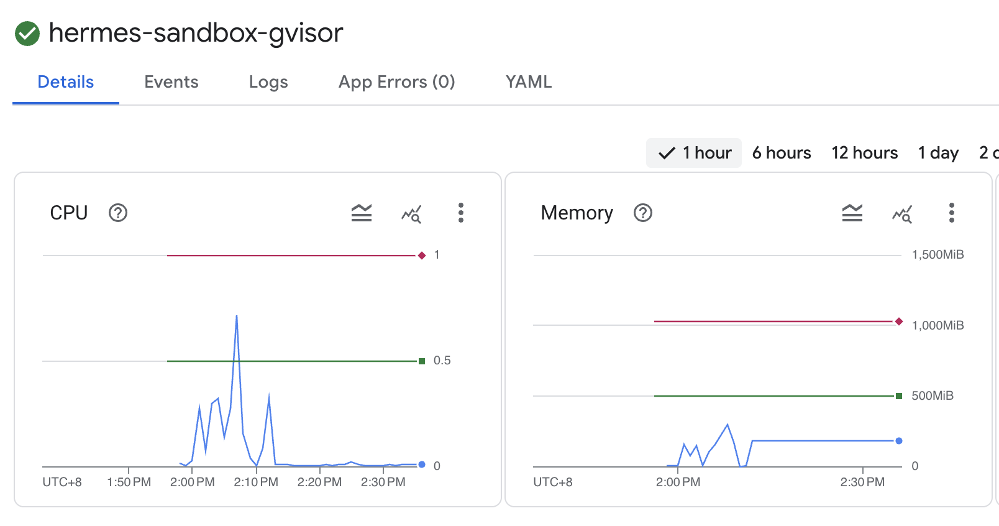

# GKE 上的 Hermes Agent 🏛️

Hermes 是由 Nous Research 开发的一款 **开源、自我进化的 AI 代理**，旨在“与你共同成长”。与传统工具不同，Hermes 建立了 **持久化记忆**，能从经验中创造出 **可重用的技能**，并通过 **闭环学习机制** 不断优化自身能力。

## 🌟 方案亮点
- **功能完备的 UI**: 管理代理、工具及对话。
- **Vertex AI 原生支持**: 深度集成 Google Gemini 系列模型。
- **自动化生命周期**: 结合 Cloud Build 实现可靠、可重复的部署。
- **本地优先与隐私**: 私有化部署于 GKE 基础设施，确保最高级别的数据隐私。
- **轻量高效**: 极低的资源占用（500Mi RAM），非常适合对成本敏感的部署场景。

---

## 🔥 Hermes 一键部署

您现在可以使用此目录下的专用配置快速部署 Hermes。

```bash
# 自动获取项目信息
export PROJECT_ID=<您的项目 ID>

# 设置项目并启用必要的 API
gcloud config set project $PROJECT_ID
gcloud services enable cloudresourcemanager.googleapis.com container.googleapis.com servicenetworking.googleapis.com cloudbuild.googleapis.com compute.googleapis.com file.googleapis.com aiplatform.googleapis.com

export PROJECT_NUMBER=$(gcloud projects list --filter="projectId:$PROJECT_ID" --format="value(projectNumber)")
export REGION="us-central1"
export ZONE="us-central1-a"

# 为 Compute 账号授予必要权限（基础设施/GKE 管理所需）
gcloud projects add-iam-policy-binding $PROJECT_ID \
    --member="serviceAccount:$PROJECT_NUMBER-compute@developer.gserviceaccount.com" \
    --role="roles/editor"

gcloud projects add-iam-policy-binding $PROJECT_ID \
    --member="serviceAccount:$PROJECT_NUMBER-compute@developer.gserviceaccount.com" \
    --role="roles/container.admin"

gcloud projects add-iam-policy-binding $PROJECT_ID \
    --member="serviceAccount:$PROJECT_NUMBER-compute@developer.gserviceaccount.com" \
    --role="roles/iam.admin"

gcloud projects add-iam-policy-binding $PROJECT_ID \
    --member="serviceAccount:$PROJECT_NUMBER-compute@developer.gserviceaccount.com" \
    --role="roles/resourcemanager.projectIamAdmin"
```

### 确保组织策略 compute.disableNestedVirtualization 已关闭（可选）
```bash
# 生成包含变量扩展的策略文件
cat <<EOF > policy.yaml
name: projects/$PROJECT_ID/policies/compute.disableNestedVirtualization
spec:
  inheritFromParent: false
  rules:
  - enforce: false
EOF

gcloud org-policies set-policy policy.yaml
```

### 2. 执行部署
```bash
# 克隆仓库并部署
git clone https://github.com/Leisureroad/ai-agent-sandbox-on-gke.git
cd ai-agent-sandbox-on-gke

gcloud builds submit --config ./hermes/cloudbuild.yaml \
  --substitutions=_REGION="$REGION",_ZONE="$ZONE"
```

### 3. 部署验证
通过检查 Pod 状态来验证 Hermes 部署是否成功。

### 4. Hermes 命令行工具
您可以直接在沙箱容器内运行 Hermes CLI 命令。
```bash
kubectl exec -it hermes-sandbox-gvisor -- hermes setup
kubectl exec -it hermes-sandbox-gvisor -- hermes gateway run
kubectl exec -it hermes-sandbox-gvisor -- hermes pairing list
kubectl exec -it hermes-sandbox-gvisor -- hermes chat
```

### 5. 验证 Pod 快照 (Pod Snapshot)
```bash
# 手动触发快照
kubectl apply -f - <<EOF
apiVersion: podsnapshot.gke.io/v1alpha1
kind: PodSnapshotManualTrigger
metadata:
  name: example-manual-trigger
spec:
  targetPod: hermes-sandbox-gvisor
EOF

# 彻底删除 hermes pod
kubectl delete pod hermes-sandbox-gvisor

# 等待 pod 重新创建（从快照恢复）
kubectl wait --for=condition=ready pod hermes-sandbox-gvisor --timeout=5m

# 检查 Pod 快照恢复状态
kubectl describe pod hermes-sandbox-gvisor

输出示例：
Events:
  Type    Reason              Age   From               Message
  ----    ------              ----  ----               -------
  Normal  Scheduled           50s   default-scheduler  Successfully assigned default/hermes-sandbox-gvisor to gke-ai-sandbox-cluste-gvisor...
  Normal  Pulling             48s   kubelet            spec.initContainers{init-config}: Pulling image "busybox:latest"
  ...
  Normal  GKEPodSnapshotting  42s   gke-pod-snapshots  Successfully restored the pod from PodSnapshot default/375062cb-ed8b-409f-902c-04adfc95a6e2
  Normal  Started             42s   kubelet            spec.containers{hermes}: Container started
```

### 6. Hermes 资源占用分析

Hermes 针对低资源环境进行了深度优化。基于真实的 GKE 监控指标：

- **内存效率**: 平均内存占用保持在 **~200MiB** 左右，显著低于大多数 Agent 框架。这使得单节点可以支持极高密度的多租户托管。
- **CPU 特征**: 空闲时 CPU 占用接近于零；在执行任务时的突发负载也能被完美控制在 **1.0 core** 限制内。
- **秒级休眠与恢复**: 得益于极小的资源足迹，Hermes 可以通过 Pod 快照快速进入休眠或从休眠中恢复，而不会产生沉重的硬件开销。


