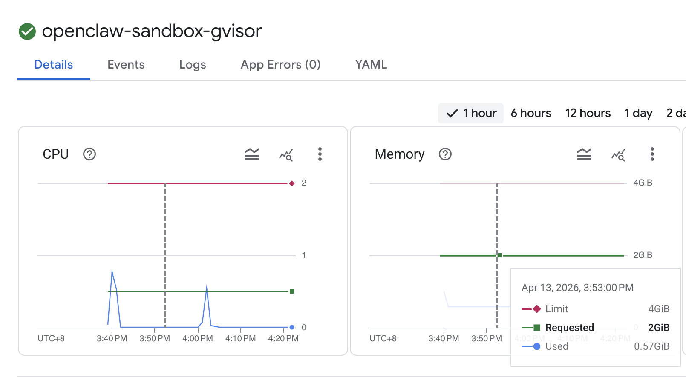

# OpenClaw Agent on GKE 🏛️

OpenClaw is an **open-source, self-hosted autonomous AI agent** designed to act as an **agentic interface** that can take direct actions on your behalf. Unlike standard chatbots, OpenClaw can execute shell commands, manage files, and automate web tasks, serving as a persistent, always-on personal assistant.

## 🌟 Solution Highlights
- **Full-featured UI**: Manage agents, tools, and conversations.
- **Vertex AI Native**: Deeply integrated with Google's Gemini models.
- **Automated Lifecycle**: Powered by Cloud Build for reliable, repeatable deployments.
- **Local-First & Private**: Self-hosted on your GKE infrastructure for maximum data privacy.

---

## 🔥 One-Click OpenClaw Deployment (HOT)

You can now deploy OpenClaw using the dedicated configuration within this directory.

```bash
# Get project info automatically
export PROJECT_ID=<YOUR_PROJECT_ID>

# Set project and enable required APIs
gcloud config set project $PROJECT_ID
gcloud services enable cloudresourcemanager.googleapis.com container.googleapis.com servicenetworking.googleapis.com cloudbuild.googleapis.com compute.googleapis.com file.googleapis.com aiplatform.googleapis.com

export PROJECT_NUMBER=$(gcloud projects list --filter="projectId:$PROJECT_ID" --format="value(projectNumber)")
export REGION="us-central1"
export ZONE="us-central1-a"

# Grant necessary roles to the Compute account (required for Infrastructure/GKE management)
gcloud projects add-iam-policy-binding $PROJECT_ID \
    --member="serviceAccount:$PROJECT_NUMBER-compute@developer.gserviceaccount.com" \
    --role="roles/editor"

gcloud projects add-iam-policy-binding $PROJECT_ID \
    --member="serviceAccount:$PROJECT_NUMBER-compute@developer.gserviceaccount.com" \
    --role="roles/container.admin"

gcloud projects add-iam-policy-binding $PROJECT_ID \
    --member="serviceAccount:$PROJECT_NUMBER-compute@developer.gserviceaccount.com" \
    --role="roles/iam.admin"

gcloud projects add-iam-policy-binding $PROJECT_ID \
    --member="serviceAccount:$PROJECT_NUMBER-compute@developer.gserviceaccount.com" \
    --role="roles/resourcemanager.projectIamAdmin"
```

### Ensure Organization Policy compute.disableNestedVirtualization is Off (Optional)
```bash
# Generate the policy file with variable expansion
cat <<EOF > policy.yaml
name: projects/$PROJECT_ID/policies/compute.disableNestedVirtualization
spec:
  inheritFromParent: false
  rules:
  - enforce: false
EOF

gcloud org-policies set-policy policy.yaml
```

### 2. Run the Deployment
```bash
# Clone and Deploy
git clone https://github.com/Leisureroad/ai-agent-sandbox-on-gke.git
cd ai-agent-sandbox-on-gke

gcloud builds submit --config ./openclaw/cloudbuild.yaml \
  --substitutions=_REGION="$REGION",_ZONE="$ZONE"
  
gcloud container clusters get-credentials ai-sandbox-cluster --region $REGION --project $PROJECT_ID
kubectl port-forward pod/openclaw-sandbox 18789:18789
```

### 3. Access the Web UI: Open http://localhost:18789 in your browser.

### 4. Openclaw CLI
You can run OpenClaw CLI commands directly inside the sandbox container.
```bash
kubectl exec -it openclaw-sandbox -- openclaw --help
```


### 5. Verify Pod Snapshot
```bash
# Trigger a snapshot manually
kubectl apply -f - <<EOF
apiVersion: podsnapshot.gke.io/v1alpha1
kind: PodSnapshotManualTrigger
metadata:
  name: example-manual-trigger
spec:
  targetPod: openclaw-sandbox-gvisor
EOF

# kill openclaw pod
kubectl delete pod openclaw-sandbox-gvisor

# wait for the pod to be recreated
kubectl wait --for=condition=ready pod openclaw-sandbox-gvisor --timeout=5m

# check the pod snapshotting status
kubectl describe pod openclaw-sandbox-gvisor

Events:
  Type    Reason              Age   From               Message
  ----    ------              ----  ----               -------
  Normal  Scheduled           34s   default-scheduler  Successfully assigned default/openclaw-sandbox-gvisor to gke-ai-sandbox-cluste-gvisor-nodepool-d6ee1e94-1dx9
  Normal  Pulled              31s   kubelet            spec.containers{openclaw}: Container image "us-central1-docker.pkg.dev/flius-test-20/ghcr/openclaw/openclaw:2026.3.23" already present on machine and can be accessed by the pod
  Normal  Created             31s   kubelet            spec.containers{openclaw}: Container created
  Normal  GKEPodSnapshotting  28s   gke-pod-snapshots  Successfully restored the pod from PodSnapshot default/9d0ec38b-f6ae-4f87-927a-aac461c61f9d
  Normal  Started             28s   kubelet            spec.containers{openclaw}: Container started
```

### 6. OpenClaw Resource Usage

